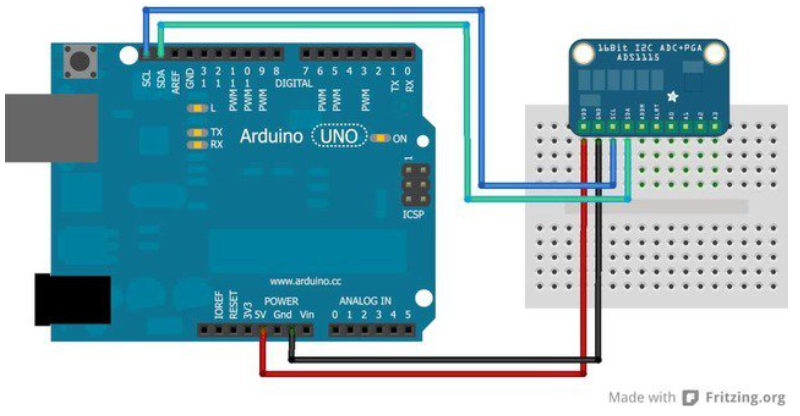

# Zusammenbau des Arduinos und dem Adafruit ADS 1115

## Verbindungen
Folgende Verbindungen müssen zu dem Adafruit ADS1115 hergestellt werden:
* 5V an VDD
* GND and GND
* SCL an SCL
* SDA an SDA

Anschließend kann eine differentielle Spannung über die Eingänge 0 und 1 sowie 2 und 3 gemessen werden. 
Das Datenblatt für den ADS1115 findet sich auf [https://cdn-learn.adafruit.com/downloads/pdf/adafruit-4-channel-adc-breakouts.pdf](https://cdn-learn.adafruit.com/downloads/pdf/adafruit-4-channel-adc-breakouts.pdf)