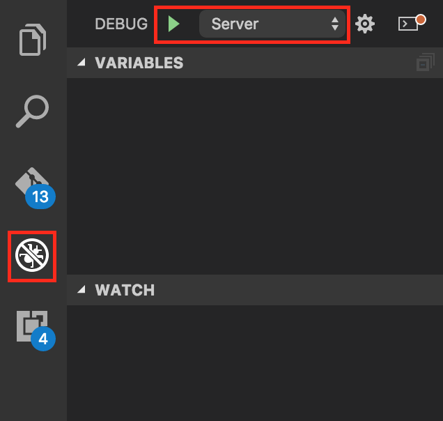

# Server
The express-server handles communication with the serialport and sketches on the arduino. 
It includes a static-fileserver as well as http-api and websocket-api.

## Development

The server-source-code is located in `server/`.

Folders:
* core: contains all core-modules
* boot: boots application modules like http-api and websockets.
* api: contains all http-api
* addon: contains addons (for example platform-specific operations)

Core-modules:
* serialport: handles all communication with the serialport
* sketch: handles communication and stores information for the sketch
* server: express-server

### Start Server from command-line
To start the server you have to build it first with 
```
npm run build:server
```
After the server is build you can run it with:
```
node build/server
```

### Start Server from Visual Studio Code
If you use [Visual Studio Code](https://code.visualstudio.com/) you can start the server through the debug menu:



Visual Studio Code will build the server and launch it in the debugger. 
For information on how to debug with Visual Studio Code see [Debugging in Visual Studio Code](https://code.visualstudio.com/docs/editor/debugging).


## API

### HTTP
The HTTP-API is located in `server/api/index.ts`.

```ts
server.get('/api/v0/serialport/list', get_list);
```
`get_list` is a function which is defined in `server/api/serialport.ts` and looks like this:
```ts
export function get_list(req: express.Request, res: express.Response, next: express.NextFunction) {
	try {
		res.json(serialport.ports);
	} catch (err) {
		res.json(err);
	}
}
```
API-functions require three arguments:
  1. request
  2. response
  3. next
  
For more information about the `request` and `reponse` arguments see [express-api](http://expressjs.com/en/4x/api.html). 
For information about the `next`-argument see [express-middleware](http://expressjs.com/en/guide/using-middleware.html).

### Websockets
The Websocket-API is set up in `server/boot/socket.ts`.
Each core-module has its own websocket-channel consisting of `/` and the name of the module.
Serialport for example has the websocket-channel `/serialport`.
Events from the modules are routed to websocket-event-emits.

#### Example
The data-event of the serialport emits a `data`-event on the `/serialport`-websocket-channel.
The routing looks like this:
```ts
serialport.on('data', (data) => channel['serialport'].emit('data', data));
```
