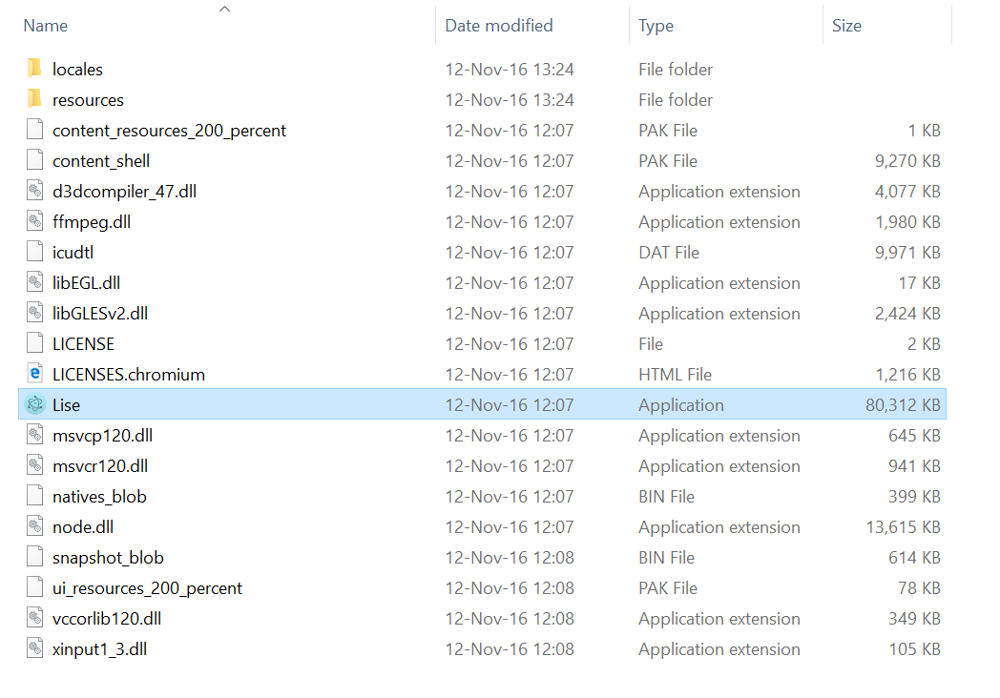

# Installation auf Windows
Die App für Windows kann auf [Lise.education](http://Lise.education/) als .zip heruntergeladen werden.
Nach dem Download muss die .zip Datei entpackt werden. Die App ist zum jetztigen Zeitpunkt noch nicht als Installer verpackt. 
Der Inhalt der .zip Datei sieht dementsprechend folgendermaßen aus:

  

Durch Ausführen der Datei "Lise" wird die App gestartet. Es ist wichtig dass die Ordner-Struktur in dieser Form beibehalten wird und die "Lise"-Datei nicht an einen anderen Ort versetzt wird.

## In Zukunft wird ein Installer existieren, der nur noch aus einer einzigen ausführbaren Datei besteht.