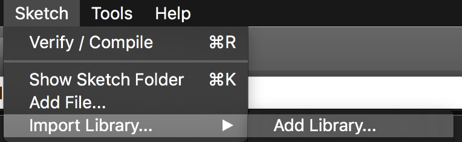

Installation
================
Dies ist eine Anleitung zum Installieren auf einem Arduino-Yun. Vorraussetzung für die Installation ist, dass sich der Ardunio-Yun angeschaltet im Netzwerk befindet.

  1. Download der Arduino-Entwicklungumgebung von [https://www.arduino.cc/en/Main/Software](https://www.arduino.cc/en/Main/Software)
  2. Download der Adafruit-Library von [https://github.com/adafruit/Adafruit_ADS1X15/archive/1.0.0.zip](https://www.arduino.cc/en/Main/Software)
  3. In der Arduino-Entwicklungumgebung muss nun die Adafruit-Library hinzugefügt werden:
  	
  4. Download des Sketches von [https://github.com/JPSchellenberg/Lise/blob/development/sketch/ino/adafruit_differential_yun/adafruit_differential_yun.ino](https://github.com/JPSchellenberg/Lise/blob/development/sketch/ino/adafruit_differential_yun/adafruit_differential_yun.ino)
  5. Den Sketch mit der Arduino-Entwicklungumgebung öffnen und auf den Yun übertragen.
  6. Download von [Lise-openWRT](http://lise.education/download/Lise-openWRT.zip)
  7. Upload der Dateien auf den Yun:

    scp -r <lokaler_ordner> root@arduino.local:/srv/lise

  8. Um alle benötigten Dateien auf dem Yun zu installieren muss sich per ssh mit dem Yun verbunden werden. Dieser Befehl verlangt in der Regel ein Passwort. Bei einem neuen Yun ist dieses Passwort "arduino". Nach Eingabe des Passwort befindet man sich auf dem Yun.

    ssh root@arduino.local

  9. Auf dem Yun muss nun in den Ordner `/srv/lise` gewechselt werden

    cd /srv/lise

  10. Im order `/srv/lise` muss nun nur noch folgender Befehl ausgeführt werden:

    ./install

  11. Der Yun sollte bei erfolgreicher Installation neu starten. Nach ca. 1,5 Minuten ist das Programm über `http://arduino.local:3000` zu erreichen.