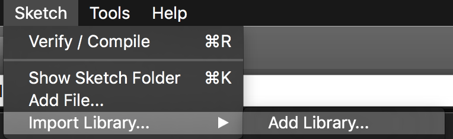

# Upload

Überspielen des Sketches auf den Arduino
================
Dies ist eine Anleitung zum Installieren des Skecthes auf einem Arduino-Leonardo.

  1. Download der Arduino-Entwicklungumgebung von [https://www.arduino.cc/en/Main/Software](https://www.arduino.cc/en/Main/Software)
  2. Download der Adafruit-Library von [https://github.com/adafruit/Adafruit_ADS1X15/archive/1.0.0.zip](https://github.com/adafruit/Adafruit_ADS1X15/archive/1.0.0.zip)
  3. In der Arduino-Entwicklungumgebung muss nun die Adafruit-Library hinzugefügt werden:
  	
  4. Download des Sketches von [https://github.com/JPSchellenberg/Lise/blob/development/sketch/ino/adafruit_differential/adafruit_differential.ino](https://github.com/JPSchellenberg/Lise/blob/development/sketch/ino/adafruit_differential/adafruit_differential.ino)
  5. Den Sketch mit der Arduino-Entwicklungumgebung öffnen und auf den Arduino übertragen.

Für weitere Hilfe mit der Arduino-Entwicklungumgebung steht ein "Getting Started" von Arduino bereit: [https://www.arduino.cc/en/Guide/HomePage](https://www.arduino.cc/en/Guide/HomePage)

